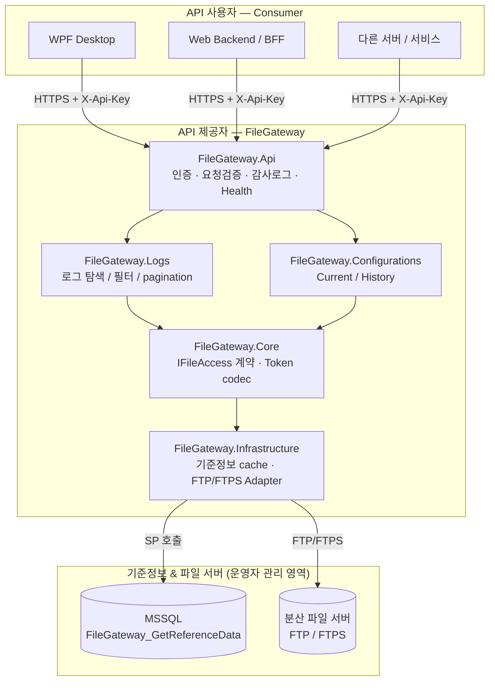
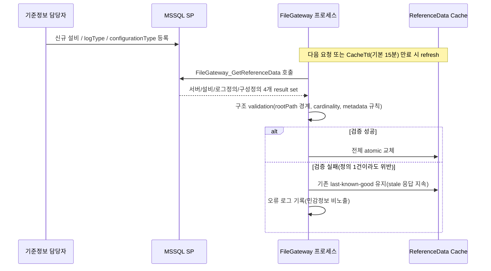
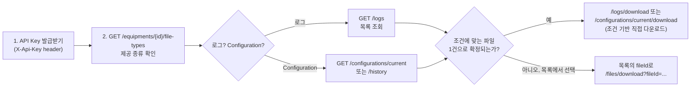
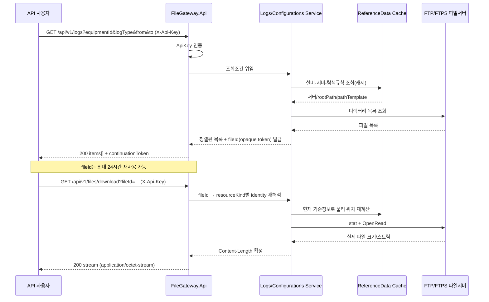
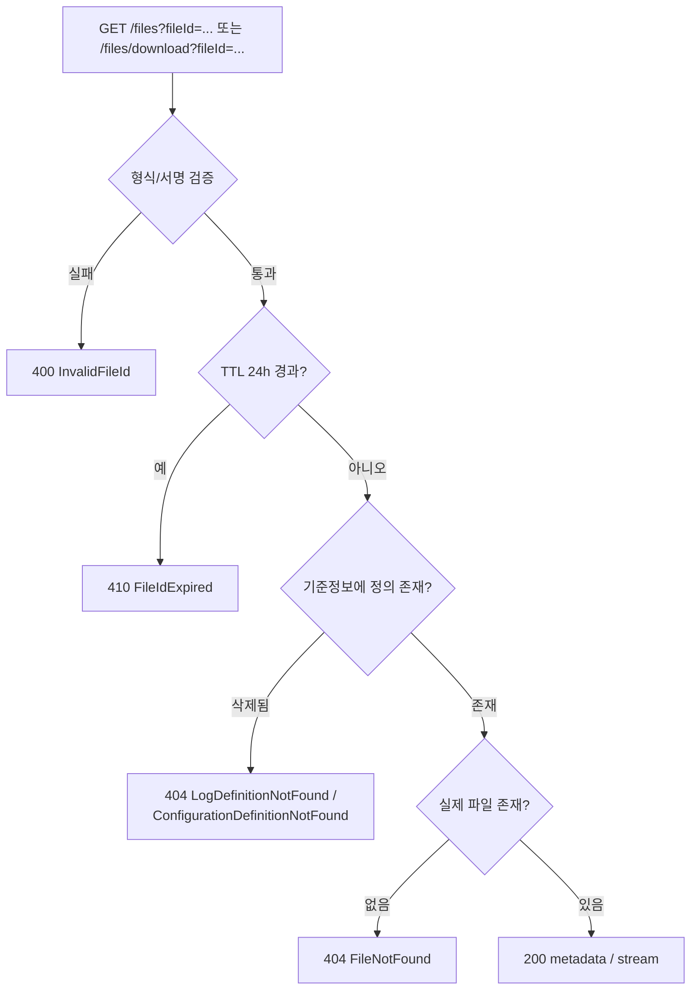

# FileGateway

분산 파일 서버에 이미 저장된 **설비 로그와 Configuration File**을 여러 애플리케이션/시스템에 조회·다운로드 형태로 제공하는 읽기 전용 File Gateway입니다.

API 소비자는 실제 파일 서버 주소나 물리 경로를 알 필요 없이 `equipmentId`와 논리 조회 조건만 사용합니다. FileGateway는 MSSQL 기준정보를 통해 대상 서버와 파일 탐색 규칙을 해석하고 FTP/FTPS로 파일을 읽어 제공합니다.

> 설비 직접 접속, 로그 수집/가공, Configuration History 생성·복사·보관은 별도 시스템 책임이며 FileGateway 범위가 아닙니다.

## 현재 상태

MVP 구현이 완료되어 통합 검증 단계를 거쳤습니다(단위/통합 테스트 전 통과). 배포는 [`docs/10-testing-and-deployment.md`](docs/10-testing-and-deployment.md)의 "배포 전 필수 확인" 목록을 통과해야 MVP 완료로 간주합니다.

## 아키텍처 한눈에 보기

API 제공자(FileGateway 운영자)와 API 사용자(클라이언트 개발자) 모두 아래 그림 하나로 전체 그림을 파악할 수 있습니다.



- API 사용자는 `Gateway`/`Backend` 내부 구조를 몰라도 됩니다 — `equipmentId` + 논리 조건만으로 호출합니다.
- API 제공자는 `Backend`(MSSQL 기준정보, 파일 서버 연결정보)를 등록/운영하는 쪽입니다. 아래 "API 제공자 가이드" 참조.

## 설치

### 사전 요구사항

- .NET 10 SDK (`global.json` 고정 버전 — `dotnet --version`으로 확인)
- MSSQL 인스턴스 + `dbo.FileGateway_GetReferenceData` Stored Procedure(`db/mvp-stored-procedure.sql`, 테스트/개발용 스키마는 `db/mvp-schema.sql`)
- FTP/FTPS로 접근 가능한 분산 파일 서버 및 해당 계정
- (통합 테스트 실행 시) Docker — Testcontainers가 MSSQL 컨테이너를 띄움

### 로컬 개발 실행

```bash
git clone <repo-url>
cd FileGateway
dotnet build
dotnet test                              # 단위 + 통합(Testcontainers) 전체
dotnet run --project src/FileGateway.Api # 기본 개발 서버 기동 (launchSettings.json "http" 프로필)
```

`launchSettings.json` 기준 기본 바인딩은 `http://localhost:5178`(HTTPS로 기동하려면 `dotnet run --project src/FileGateway.Api --launch-profile https` → `https://localhost:7108`). IIS 배포 시 실제 포트/바인딩은 별도입니다.

로컬 개발 시 비밀은 `dotnet user-secrets` 또는 환경변수로 주입합니다(아래 "비밀 주입" 참조). `appsettings.Development.json`에는 비밀을 넣지 않습니다.

### 최소 설정 확인

기동 직후 아래로 헬스체크합니다.

```bash
curl http://localhost:5178/health/live    # 프로세스 생존만 확인
curl http://localhost:5178/health/ready   # 기준정보 최초 로딩 유발 + 상태 반영
```

`/health/ready`는 usable 캐시가 있으면 stale이어도 `200 {"status":"Degraded","stale":true}`를 반환합니다. usable 캐시가 전혀 없으면(최초 기동 시 DB 연결 실패 등) `503 {"status":"Unhealthy"}`입니다 — 이 503은 API 오류 응답(`code`/`traceId` 포함 Problem Details)이 아니라 health 전용 shape입니다.

## 실행 / 배포

빌드/테스트/로컬 실행 명령은 위 "설치 > 로컬 개발 실행" 참조.

### 설정 항목 (`appsettings.json` 기준값)

| Key | 기본값 | 의미 |
|---|---|---|
| `FileGateway:Logs:MaxQueryRange` | `31.00:00:00` | 로그 시간 범위 조회 최대 폭(≥2일 필요) |
| `FileGateway:Configurations:HistoryMaxQueryRange` | `366.00:00:00` | Configuration History 조회 최대 폭 |
| `FileGateway:Paging:LimitDefault` / `LimitMax` | `100` / `1000` | 목록 pagination `limit` 기본/최댓값 |
| `FileGateway:Tokens:FileIdTtl` | `1.00:00:00` | `fileId` 유효기간(24시간) |
| `FileGateway:Tokens:ContinuationTtl` | `00:30:00` | `continuationToken` 유효기간 |
| `FileGateway:ReferenceData:CacheTtl` | `00:15:00` | 기준정보 캐시 TTL(만료 시 stale 즉시 반환 + single-flight 백그라운드 refresh) |
| `FileGateway:Ftp:Security` | `Plain` | `Plain \| ExplicitTls \| ImplicitTls` |
| `FileGateway:Ftp:AcceptUntrustedCertificates` | `false` | 내부 self-signed 인증서 허용 여부(운영 판단 필요) |
| `FileGateway:Ftp:ConnectTimeoutSeconds` / `ReadTimeoutSeconds` | `15` / `60` | FTP 연결/읽기 타임아웃 |
| `FileGateway:Ftp:MaxConcurrentGlobal` / `MaxConcurrentPerServer` | `50` / `5` | FTP 동시 접속 상한(전체/서버별) |

### 비밀 주입

비밀은 파일에 두지 않고 환경변수(또는 IIS/Secret 관리 도구)로만 주입합니다:

- `Authentication__ApiKeys__0__Key` / `Authentication__ApiKeys__0__CallerId` — API Key(복수 호출자는 인덱스 `1`, `2`...로 추가)
- `ConnectionStrings__ReferenceData` — MSSQL 기준정보 연결 문자열
- `FileGateway__Ftp__UserName` / `FileGateway__Ftp__Password` — FTP 계정
- `DataProtection__KeyDirectory` — DataProtection 키 저장 디렉터리. Development 환경은 미설정 시 ephemeral 경고 로그만 남기지만, **Development 외 환경은 미설정 시 기동 자체가 실패**합니다(`InvalidOperationException`). IIS 배포 시 필수 값입니다.

API Key 회전 예시(overlap 배포):

```bash
# 구 key(index 0) 유지한 채 신규 key(index 1) 추가 → 앱 재시작/재배포
Authentication__ApiKeys__0__Key=<old-key>
Authentication__ApiKeys__0__CallerId=wpf-client
Authentication__ApiKeys__1__Key=<new-key>
Authentication__ApiKeys__1__CallerId=wpf-client
# 클라이언트 전환 확인 후 index 0 제거 → 재배포
```

### IIS 배포

- .NET Hosting Bundle(ASP.NET Core Module V2) 설치 후 In-process(`web.config` 참조)로 호스팅
- `DataProtection:KeyDirectory`는 App Pool 재시작 후에도 유지되는 경로(예: 전용 로컬 디렉터리)로 지정 — 유실 시 모든 `fileId`가 무효화됨. Windows에서는 저장된 키가 자동으로 DPAPI로 암호화되며, 이때 **current-user 범위**(키가 실행 프로세스 계정, 즉 App Pool identity에 귀속)로 보호된다. 이것이 동작하려면 IIS Application Pool의 **"Load User Profile"을 반드시 `true`**로 설정해야 한다 — 미설정 시 App Pool identity의 DPAPI 사용자 프로필 저장소가 로드되지 않아 키 protect/unprotect가 실패할 수 있다(`applicationHost.config` 수준 설정이며 `web.config`로 제어되지 않음). 추가 방어 계층으로 해당 디렉터리의 파일시스템 ACL을 App Pool identity만 접근 가능하도록 제한할 것(DPAPI와 ACL은 상호 보완 관계)
- FTP Passive 모드 사용 시 파일 서버의 Passive 포트 범위가 방화벽에서 열려 있는지 확인
- FTP 보안: `FileGateway:Ftp:Security` = `Plain | ExplicitTls | ImplicitTls`. 내부 self-signed 인증서 허용은 `AcceptUntrustedCertificates: true`로만(운영 판단 필요)
- 배포 전 필수 확인 목록: [`docs/10-testing-and-deployment.md`](docs/10-testing-and-deployment.md) "배포 전 필수 확인"
- **실 배포 시 수동 검증 체크리스트(MVP 완료 게이트)**: [`docs/DEPLOYMENT-CHECKLIST.md`](docs/DEPLOYMENT-CHECKLIST.md) — 항목별 통과/차단 기록용

구현/변경 작업은 [`docs/INDEX.md`](docs/INDEX.md)를 시작점으로 역할별 설계 문서를 확인합니다.

## API 제공자 가이드 (운영자)

FileGateway는 코드 배포와 별개로 **MSSQL 기준정보**를 통해 "어떤 설비가 어떤 서버의 어떤 규칙으로 어떤 파일을 제공하는지"를 정의합니다. 새 설비/로그종류/구성종류 추가는 대부분 DB 등록만으로 끝나고 코드 배포가 필요 없습니다.



- refresh는 FTP 서버 실재 여부를 확인하지 않습니다 — 파일이 실제로 있는지는 목록/다운로드 시점에만 확인합니다.
- 검증 실패는 **전체 refresh 거부**입니다. 잘못된 정의 1건이 나머지 정상 설비까지 막지 않도록, 등록 전 `rootPath` 경계·cardinality를 점검하세요(상세: [`06-reference-data.md`](docs/06-reference-data.md)).
- 최초 기동 시 usable 캐시가 없으면 `/health/ready`가 `503 ReferenceDataUnavailable`을 반환합니다 — DB 연결/SP 존재를 먼저 확인하세요.
- 신규 `logType`/`configurationType`이 기존 Hourly/Daily/Continuous/Current/History 계약으로 표현 가능하면 코드 수정 없이 DB 등록만으로 노출됩니다. 표현 불가능한 새 계약이 필요하면 [`04a-log-provider.md`](docs/04a-log-provider.md)/[`04b-configuration-provider.md`](docs/04b-configuration-provider.md)부터 검토하세요.

## API 사용자 가이드 (소비자)

- 사용자용 WPF 데스크톱 애플리케이션
- Web Backend / BFF
- 파일을 받아가야 하는 다른 서버/서비스

호출 구현은 .NET, Python 등 일반적인 HTTP 클라이언트 환경을 사용할 수 있습니다. 브라우저가 FileGateway API Key를 직접 보유하는 구조는 전제로 하지 않습니다.

### 권장 호출 순서



- 파일 1건이 확실하면 조건 기반 직접 다운로드가 왕복을 줄여줍니다. 2건 이상 걸리면 `409 MultipleFilesMatched`이므로 목록 조회로 전환하세요.
- 목록에서 받은 `fileId`는 24시간 동안 재사용 가능한 opaque 토큰입니다. 물리 경로가 나중에 바뀌어도 같은 논리 파일이면 그대로 유효합니다.

### 목록 조회 → fileId 발급 → 다운로드 시퀀스



### fileId 오류 분류



## 주요 기능

- 설비별 제공 가능한 `logType` / `configurationType` 조회
- Hourly / Daily / Continuous 로그 목록 조회
- `subtype` / 동적 attributes 기반 로그 필터
- Current Configuration File 집합 조회
- Configuration Snapshot History 조회
- 논리 `fileId` 기반 파일 metadata 조회 및 streaming download
- 조건 기반 직접 다운로드
- `limit + continuationToken` 기반 목록 pagination
- DB 기준정보 기반 파일 종류/탐색 규칙 확장

기존 계약으로 표현 가능한 새 `logType` 또는 `configurationType`은 DB 기준정보 추가만으로 확장하고, 파일 종류별 코드 분기를 늘리지 않는 것을 기본 원칙으로 합니다.

설비사나 설비 종류에 따라 제공 파일이 달라도 `equipmentId`별 기준정보 차이로 표현합니다.

## API 사용법

인증은 HTTPS + `X-Api-Key` header를 사용합니다. query string으로 key를 전달할 수 없습니다.

```http
X-Api-Key: <caller-key>
```

전체 계약(query 상세, 정렬, pagination, `fileId` 오류 구분 등)은 [`docs/05-api-interface.md`](docs/05-api-interface.md)가 기준입니다. 아래는 실제 호출 예시입니다.

> `from`/`to` 값의 UTC offset `+09:00`은 query string에서 `%2B09:00`으로 URL-encoding해야 합니다(그대로 `+`를 보내면 공백으로 디코딩되어 파싱 실패). curl 예시는 이미 encoding된 형태입니다.

### 1. 설비별 제공 파일 종류 조회

```bash
curl -s https://gateway.example/api/v1/equipments/EQ-001/file-types \
  -H "X-Api-Key: $API_KEY"
```

```json
{
  "equipmentId": "EQ-001",
  "logs": [
    { "logType": "EventLog", "generationType": "Hourly" },
    { "logType": "TraceLog", "generationType": "Continuous" }
  ],
  "configurations": [
    { "configurationType": "PM" }
  ]
}
```

FTP를 스캔하지 않고 DB 기준정보 snapshot만 반환합니다. `equipmentId` 없음 → `404 EquipmentNotFound`.

### 2. 로그 목록 조회 (Hourly/Daily)

```bash
curl -s "https://gateway.example/api/v1/logs?equipmentId=EQ-001&logType=EventLog&from=2026-08-20T00:00:00%2B09:00&to=2026-08-21T00:00:00%2B09:00&limit=50" \
  -H "X-Api-Key: $API_KEY"
```

```json
{
  "items": [
    {
      "fileId": "eyJh...opaque",
      "fileName": "EventLog_20260820_09.log",
      "equipmentId": "EQ-001",
      "logType": "EventLog",
      "subtype": null,
      "timestamp": "2026-08-20T09:00:00+09:00",
      "size": 10240,
      "isContinuous": false,
      "attributes": {}
    }
  ],
  "continuationToken": null
}
```

- `from`/`to` 생략 시 최근 24시간, `from`만 있으면 `[from, from+2일)`. `to`만 단독으로 주거나 `from >= to`이면 `400 InvalidRequest`.
- 다음 페이지: 같은 조회조건에 `continuationToken`만 추가(`limit`은 페이지마다 바꿔도 됨). **`continuationToken`을 유지한 채 `equipmentId`/`logType`/`from`/`to`/`subtype`/`attr.*` 등 결과 집합을 바꾸는 조건을 변경하면 `400 InvalidRequest`** — 조건을 바꾸려면 토큰 없이 첫 페이지부터 새로 조회합니다.
- Continuous `logType`은 `from`/`to`를 주면 `400 InvalidRequest`.
- 조회 범위가 `Logs.MaxQueryRange`(기본 31일)를 초과해도 `400 InvalidRequest`.

### 3. 로그 조건 기반 직접 다운로드

```bash
curl -s -OJ "https://gateway.example/api/v1/logs/download?equipmentId=EQ-001&logType=EventLog&from=2026-08-20T09:00:00%2B09:00&to=2026-08-20T10:00:00%2B09:00" \
  -H "X-Api-Key: $API_KEY"
```

0건 → `404 FileNotFound`, 2건 이상 일치 → `409 MultipleFilesMatched`(이 경우 목록 조회로 `fileId`를 얻어 `/files/download?fileId=...` 사용).

### 4. Current Configuration 조회/다운로드

```bash
curl -s "https://gateway.example/api/v1/configurations/current?equipmentId=EQ-001&configurationType=PM" \
  -H "X-Api-Key: $API_KEY"

curl -s -OJ "https://gateway.example/api/v1/configurations/current/download?equipmentId=EQ-001&configurationType=PM" \
  -H "X-Api-Key: $API_KEY"
```

동일 `equipmentId + configurationType`에 여러 파일(PM1~PM4 등)이 있으면 직접 다운로드는 `409 MultipleFilesMatched` — 목록에서 `fileId`를 골라 공통 다운로드 endpoint를 사용합니다.

Current 목록 응답은 로그와 달리 `{items, continuationToken}` envelope가 **아닌 단순 배열**입니다(`limit`/`continuationToken` 미적용).

### 5. Configuration History 조회

```bash
curl -s "https://gateway.example/api/v1/configurations/history?equipmentId=EQ-001&configurationType=PM&from=2026-08-01T00:00:00%2B09:00&to=2026-08-24T00:00:00%2B09:00" \
  -H "X-Api-Key: $API_KEY"
```

`from`/`to` 둘 다 필수(생략 시 `400 InvalidRequest`). marker 없는 미완료 Snapshot Set은 노출되지 않습니다.

### 6. 공통 파일 조회/다운로드 (`fileId`)

```bash
curl -s "https://gateway.example/api/v1/files?fileId=$FILE_ID" \
  -H "X-Api-Key: $API_KEY"

curl -s -OJ "https://gateway.example/api/v1/files/download?fileId=$FILE_ID" \
  -H "X-Api-Key: $API_KEY"
```

`fileId`는 목록/직접 다운로드 응답에서 얻은 24시간 TTL opaque 토큰입니다. `Content-Length`는 스트림 시작 직전 실제 크기로 설정되며, 응답 헤더는 `Content-Type: application/octet-stream`, `Content-Disposition: attachment`.

### 오류 응답

```json
{
  "type": "about:blank",
  "title": "File not found",
  "status": 404,
  "code": "FileNotFound",
  "traceId": "0HN..."
}
```

| status | code | 의미 |
|---|---|---|
| 400 | `InvalidRequest` | 요청 파라미터/시간범위/토큰 조건 오류 |
| 400 | `InvalidFileId` | `fileId` 형식/서명 오류 |
| 401 | `InvalidApiKey` | `X-Api-Key` 누락/불일치 |
| 404 | `EquipmentNotFound` | 존재하지 않는 `equipmentId` |
| 404 | `LogDefinitionNotFound` / `ConfigurationDefinitionNotFound` | 기준정보 삭제로 재해석 불가 |
| 404 | `FileNotFound` | 논리 파일이 실제로 없음 |
| 409 | `MultipleFilesMatched` | 직접 다운로드 조건에 정상 파일 2건 이상 일치 |
| 410 | `FileIdExpired` | `fileId` TTL(24시간) 경과 |
| 500 | `FileDefinitionConflict` | cardinality 위반/metadata 해석 실패 |
| 500 | `InternalError` | 서버 내부 오류 |
| 502 | `FileServerUnavailable` / `FileServerProtocolError` | 파일 서버 연결/프로토콜 오류 |
| 503 | `ReferenceDataUnavailable` | 사용 가능한 기준정보 없음 |

`code`로 분기하고, 원인 추적은 `traceId`로 서버 로그와 연계합니다. 물리 경로/credential/DB 진단 정보는 오류 응답에 포함되지 않습니다.

## 클라이언트 샘플 코드

목록 조회 → `fileId` 선택 → streaming download 등 8개 유즈케이스별 Python(`requests`)/C#(`HttpClient`) 예제는 [`samples/`](samples/README.md)를 참조하세요.

아래는 가장 기본적인 목록 조회 → 다운로드 흐름의 요약 예시입니다.

### Python (requests)

```python
import os
import requests

GATEWAY = "https://gateway.example"
API_KEY = "..."  # 환경변수/Secret에서 로드, 코드에 하드코딩 금지
HEADERS = {"X-Api-Key": API_KEY}


def list_logs(equipment_id: str, log_type: str, **params) -> dict:
    resp = requests.get(
        f"{GATEWAY}/api/v1/logs",
        headers=HEADERS,
        params={"equipmentId": equipment_id, "logType": log_type, **params},
        timeout=30,  # 목록 조회는 서버측 FTP 탐색을 동반하므로 다운로드보다 넉넉하게
    )
    resp.raise_for_status()  # 4xx/5xx -> requests.HTTPError, err.response.json()["code"]로 분기
    return resp.json()
    # 다음 페이지: list_logs(..., continuationToken=result["continuationToken"])로 같은 조건 유지
    # (조건을 바꾸면서 continuationToken을 같이 보내면 400 InvalidRequest)


def download_by_file_id(file_id: str, file_name: str, dest_dir: str = ".") -> str:
    dest_path = os.path.join(dest_dir, os.path.basename(file_name))  # 서버 파일명이라도 경로요소는 제거
    with requests.get(
        f"{GATEWAY}/api/v1/files/download",
        headers=HEADERS,
        params={"fileId": file_id},  # path segment가 아닌 query — opaque token 길이가
        # URL 세그먼트 제한(예: IIS/HTTP.sys 260자)을 넘을 수 있음
        stream=True,
        timeout=(10, 60),  # (connect, read) — read는 청크당 idle timeout이지 전체 다운로드 상한이 아님
    ) as resp:
        resp.raise_for_status()
        expected = int(resp.headers.get("Content-Length", -1))
        written = 0
        with open(dest_path, "wb") as f:
            for chunk in resp.iter_content(chunk_size=1024 * 64):
                f.write(chunk)
                written += len(chunk)
        if expected >= 0 and written != expected:
            # 다운로드 시작 후 원격 I/O 오류는 JSON 오류로 전환되지 않고 스트림이 그냥 끊긴다(05 문서 참조).
            # Content-Length와 실제 기록 바이트 수를 비교해야 잘린 파일을 놓치지 않는다.
            raise IOError(f"truncated download: expected {expected} bytes, got {written}")
    return dest_path


if __name__ == "__main__":
    try:
        result = list_logs(
            "EQ-001",
            "EventLog",
            **{
                "from": "2026-08-20T00:00:00+09:00",  # requests가 %2B로 자동 encoding
                "to": "2026-08-21T00:00:00+09:00",
            },
        )
    except requests.HTTPError as err:
        body = err.response.json()  # {"type","title","status","code","traceId"}
        raise SystemExit(f"list failed: {body['code']} (traceId={body['traceId']})") from err

    items = result["items"]
    if not items:
        raise SystemExit("no matching log")

    first = items[0]
    try:
        saved_path = download_by_file_id(first["fileId"], first["fileName"])
    except requests.HTTPError as err:
        body = err.response.json()
        raise SystemExit(f"download failed: {body['code']} (traceId={body['traceId']})") from err

    print(f"saved {saved_path} ({first['size']} bytes)")
```

- `requests`는 `params=` dict를 넘기면 `+`를 자동으로 `%2B`로 인코딩합니다(README curl 예시처럼 수동 encoding 불필요).
- 오류는 `requests.HTTPError`로 던져지며, 실제 응답 body는 예외를 던진 `resp`가 아니라 **`err.response`**에 있습니다(`resp.json()`이 아니라 `err.response.json()`).
- `Content-Length`와 실제로 받은 바이트 수를 비교하세요. 다운로드 시작 후 원격 파일이 잘리거나 회전되면 서버는 JSON 오류로 전환하지 않고 스트림을 그냥 끊습니다.

### C# (HttpClient)

```csharp
using System.Net.Http.Json;
using System.Text.Json;

var apiKey = Environment.GetEnvironmentVariable("FILEGATEWAY_API_KEY")
    ?? throw new InvalidOperationException("FILEGATEWAY_API_KEY not set");

using var client = new HttpClient { BaseAddress = new Uri("https://gateway.example") };
client.DefaultRequestHeaders.Add("X-Api-Key", apiKey);

static async Task<InvalidOperationException> ProblemException(HttpResponseMessage resp)
{
    // 서버가 항상 JSON 오류 body를 주는 건 아니다(IIS/ARR 레벨 502/503 등은 HTML/빈 body일 수 있음).
    // ReadFromJsonAsync를 바로 걸면 그 경우 진짜 원인 대신 JsonException이 던져진다.
    var raw = await resp.Content.ReadAsStringAsync();
    try
    {
        var problem = JsonSerializer.Deserialize<JsonElement>(raw);
        return new InvalidOperationException(
            $"{problem.GetProperty("code")}: {problem.GetProperty("title")}");
    }
    catch (JsonException)
    {
        return new InvalidOperationException($"{(int)resp.StatusCode} {resp.StatusCode}: {raw}");
    }
}

// 1. 목록 조회 (다음 페이지는 같은 query + &continuationToken=... — 조건을 바꾸면 400 InvalidRequest)
var query = "equipmentId=EQ-001&logType=EventLog"
    + "&from=" + Uri.EscapeDataString("2026-08-20T00:00:00+09:00")
    + "&to=" + Uri.EscapeDataString("2026-08-21T00:00:00+09:00");

using var listResponse = await client.GetAsync($"/api/v1/logs?{query}");
if (!listResponse.IsSuccessStatusCode)
    throw await ProblemException(listResponse);

var listBody = await listResponse.Content.ReadFromJsonAsync<JsonElement>();
var items = listBody.GetProperty("items");
if (items.GetArrayLength() == 0)
    throw new InvalidOperationException("no matching log");

var first = items[0];
var fileId = first.GetProperty("fileId").GetString();
var fileName = Path.GetFileName(first.GetProperty("fileName").GetString()!); // 경로요소 제거

// 2. fileId로 streaming download (fileId는 query parameter — path segment로 넣으면
//    opaque token 길이 때문에 서버 URL 세그먼트 제한(예: IIS/HTTP.sys 260자)에 걸릴 수 있다)
using var downloadResponse = await client.GetAsync(
    $"/api/v1/files/download?fileId={Uri.EscapeDataString(fileId!)}", HttpCompletionOption.ResponseHeadersRead);
if (!downloadResponse.IsSuccessStatusCode)
    throw await ProblemException(downloadResponse);

await using var remoteStream = await downloadResponse.Content.ReadAsStreamAsync();
await using var fileStream = File.Create(fileName);
await remoteStream.CopyToAsync(fileStream);

// Content-Length는 서버가 보낸 "예정" 크기다. 실제 기록 바이트(fileStream.Length)와 비교해야
// 스트림 시작 후 끊긴 다운로드(짧게 받고 그냥 연결 종료)를 놓치지 않는다.
var expected = downloadResponse.Content.Headers.ContentLength;
if (expected is { } n && fileStream.Length != n)
    throw new IOException($"truncated download: expected {n} bytes, got {fileStream.Length}");

Console.WriteLine($"saved {fileName} ({fileStream.Length} bytes)");
```

- `System.Net.Http.Json`의 `ReadFromJsonAsync` 확장 메서드를 쓰려면 `using System.Net.Http.Json;`이 필요합니다(implicit usings에 기본 포함되지 않음).
- 오류 body가 항상 JSON이라고 가정하지 마세요 — IIS/ARR 레벨 오류(502/503 등)는 HTML이나 빈 body로 올 수 있어 `ReadFromJsonAsync`를 바로 걸면 원래 상태코드 대신 `JsonException`이 뜹니다. 문자열로 먼저 읽고 방어적으로 파싱하세요.
- `HttpCompletionOption.ResponseHeadersRead`로 응답 본문 전체를 버퍼링하지 않고 헤더 수신 즉시 스트림을 열어 그대로 `CopyToAsync`합니다 — 대용량 파일에서 메모리 사용을 낮게 유지합니다. 기본 `HttpClient.Timeout`(100초)은 헤더 수신까지만 적용되고 이후 body copy는 시간 제한이 없습니다(오래 걸리는 다운로드에서 정상). 응답이 없는 채로 멈춘 연결까지 끊고 싶으면 `CopyToAsync(fileStream, cancellationToken)`에 타임아웃용 `CancellationToken`을 넘기세요.
- 오류 body는 Problem Details 형태(`code`/`title`/`traceId`) JSON이지만 `Content-Type`은 `application/json`이며 `application/problem+json`이 아닙니다 — 미디어 타입으로 매칭하는 역직렬화기를 쓴다면 유의하세요.

## 구조

레이어 다이어그램은 위 "아키텍처 한눈에 보기" 참조. 계층별 책임:

- `FileGateway.Api`: HTTP API, 인증, 요청 검증, 감사로그, Health Check
- `FileGateway.Logs`: 로그 탐색/필터/논리 identity/pagination 의미
- `FileGateway.Configurations`: Current/History 탐색 및 Configuration identity
- `FileGateway.Core`: 프로토콜 비종속 파일 I/O 계약과 공통 token codec 계약
- `FileGateway.Infrastructure`: MSSQL, 기준정보 cache, FTP/FTPS, Secret/Key 공급

MVP는 ASP.NET Core/.NET을 Windows Server + IIS에서 운영하며, 실제 파일 접근은 `IFileAccess` 뒤의 FTP/FTPS Adapter가 담당합니다.

## 주요 기술 선택

- FTP/FTPS Adapter: **FluentFTP**를 `FileGateway.Infrastructure` 내부 구현으로 사용
- MSSQL 접근: **Microsoft.Data.SqlClient** 기본 사용
- 통합테스트 인프라: **Testcontainers for .NET** 활용
- Dapper: SP 결과 매핑이 복잡해질 때만 도입 검토
- Polly: 실제 transient retry/circuit-breaker 요구가 생길 때만 도입 검토

외부 라이브러리는 Core/도메인 계약에 노출하지 않고 Infrastructure/Test 경계에 우선 격리합니다. 구체 패키지 버전은 구현 시점에 지원 .NET 버전과 유지보수 상태를 확인해 고정합니다.

## 설계 원칙

- 물리 서버 주소/경로를 외부 API에 노출하지 않음
- API 소비자 입력으로 raw 파일 경로를 구성하지 않음
- 파일 전체 메모리 적재가 아닌 streaming download
- 목록 조회와 직접 다운로드가 동일 Resolver 규칙 사용
- 논리 시간 슬롯과 물리 디렉터리를 1:1로 가정하지 않음
- FileGateway는 저장된 파일을 읽어 제공할 뿐 생산 중 파일의 원자성/잠금/내용 일관성을 보정하지 않음
- 향후 다른 Site/프로토콜/Linux 확장을 허용하되 MVP에 선구현하지 않음

## 문서

**설계·요구사항·구현 작업을 시작할 때는 먼저 [`docs/INDEX.md`](docs/INDEX.md)를 확인합니다.** 작업 종류별로 어떤 역할 문서를 먼저 읽어야 하는지 정리되어 있습니다.

주요 문서:

- [`00-glossary.md`](docs/00-glossary.md) — 정식 용어
- [`01-requirements.md`](docs/01-requirements.md) — MVP 요구사항/범위
- [`02-architecture.md`](docs/02-architecture.md) — 전체 구조와 책임 경계
- [`03-server-access-core.md`](docs/03-server-access-core.md) — 공통 파일 접근 계약
- [`04a-log-provider.md`](docs/04a-log-provider.md) — Log Provider
- [`04b-configuration-provider.md`](docs/04b-configuration-provider.md) — Configuration Provider
- [`05-api-interface.md`](docs/05-api-interface.md) — 외부 API 계약
- [`06-reference-data.md`](docs/06-reference-data.md) — MSSQL 기준정보/cache
- [`07-extension-and-risks.md`](docs/07-extension-and-risks.md) — 확장성과 주요 리스크
- [`08-agent-tooling.md`](docs/08-agent-tooling.md) — Agent/Skill 운영
- [`09-security-and-operations.md`](docs/09-security-and-operations.md) — 인증/보안/운영
- [`10-testing-and-deployment.md`](docs/10-testing-and-deployment.md) — 테스트/배포

## Agent 개발 환경

프로젝트 공통 지침은 [`AGENTS.md`](AGENTS.md)를 기준으로 하며, 설계 문서는 항상 `docs/INDEX.md`에서 시작합니다.

- `CLAUDE.md` → `AGENTS.md` 심볼릭 링크
- Superpowers runtime skills: `.superpowers/skills`
- Matt Pocock design skills subset: `.mattpocock/skills`
- Claude / Codex / OpenCode / OMP에서 프로젝트 로컬 skill 링크 공유

각 skill의 출처와 프로젝트 로컬 조정 내용은 `.superpowers/UPSTREAM.md`, `.mattpocock/UPSTREAM.md`를 참조합니다.
